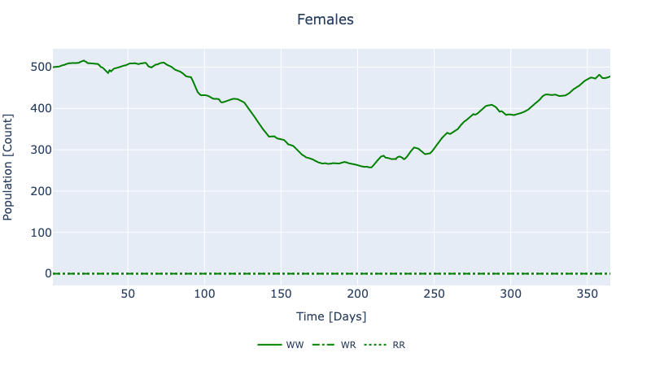

```@index
Modules = [GeneDrive]
Pages   = ["dynamic_tutorials.md"]
```
# [Dynamic Model](@id dynamic_model)

The following examples demonstrate how to create and run Ordinary Differential Equation (ODE) problems in `GeneDrive.jl`. Dynamic models allow us to understand the behavior of the system of interest; below, we see the effect of both environmental and then anthropogenic perturbations.

## [Environmental Dynamics](@id environmental_dynamics)

First, we will characterize the impact of seasonal temperature fluctuations on our study population. This experiment uses the information from the `node2` data model created in the [previous example](@ref data_model).

```@setup dynamic_example
using GeneDrive
using OrdinaryDiffEq
using Pkg
species = AedesAegypti
genetics = genetics_mendelian()
enviro_response = stages_rossi()
update_population_size!(enviro_response, 500)
organisms = make_organisms(species, genetics, enviro_response)
temperature = example_temperature_timeseries
coordinates2 = (17.0966, 145.7747)
node2 = Node(:Gordonsvale, organisms, temperature, coordinates2);
```

```@example dynamic_example
# Define the time horizon
tspan = (1,365)

# Select solver from the suite of available methods
solver = OrdinaryDiffEq.Tsit5()

# Solve
sol = solve_dynamic_model(node2, solver, tspan);

# Format all results for analysis
results = format_dynamic_model_results(node2, sol)
```
To visualize a subset of the results, run `using PlotlyJS` followed by `plot_dynamic_mendelian_females(node2, sol)`. For the `AedesAegypti` species modelled in this example, we are particularly interested in the dynamics of adult females because female mosquitoes are the vectors of disease.

Note that the solver is sourced from the robust DifferentialEquations.jl package (options [here](https://diffeq.sciml.ai/stable/solvers/ode_solve/#Full-List-of-Methods)). If that package is not already in your local environment, run the following to select your preferred solution method:

```julia
julia> Pkg.add(OrdinaryDiffEq)
julia> using OrdinaryDiffEq
```

## [Intervention Dynamics](@id intervention_dynamics)

Here we model the dynamics of public health interventions that release genetically modified mosquitoes to replace or suppress wildtypes (mitigating the risk of disease spread). This experiment also accounts for the environmental dynamics we saw above. Importantly, the timing, size, sex, and genotype used for interventions varies according to the genetic tool.

The code below demonstrates how to set up the RIDL (Release of Insects with Dominant Lethal) intervention, therefore only male organisms that are homozygous for the modification are released.
```@example dynamic_example
# Use new genetics
genetics = genetics_ridl();

# Re-use other organismal data for brevity
organisms = make_organisms(species, genetics, enviro_response);

# Define a new location
coordinates3 = (16.9203, 145.7710)
node3 = Node(:Cairns, organisms, temperature, coordinates3);

# Define the size and timing of releases
release_size = 100;
release_times = [4.0, 11.0, 18.0, 25.0, 32.0, 39.0,
    46.0, 53.0, 60.0, 67.0];

# The genotype to be released (apply helper function)
release_genotype = get_homozygous_modified(node3, species)

# Specify the sex of releases and create the `Release` object
releases_males = Release(node3, species, Male, release_genotype,
    release_times, release_size);
```

With the new problem now set up, we solve it and analyze the results:
```@example dynamic_example
# Solve (re-use solver and tspan from previous example)
sol = solve_dynamic_model(node3, [releases_males],
    solver, tspan);

# Format all results for analysis
results = format_dynamic_model_results(node3, sol)
```
To visualize a subset of the results, run `plot_dynamic_ridl_females(node3, sol)`.

The output should look as follows: 



